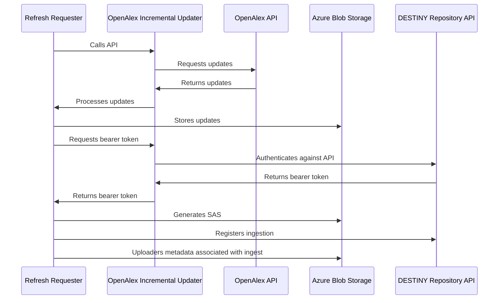

# OpenAlex Incremental Updater

A service to offer incremental updates from the OpenAlex API to the DESTINY repository.

## Overview

This repository contains two main components:

- **OpenAlex Incremental Updater**: A FastAPI service that fetches and processes updates from the OpenAlex API, storing them in a PostgreSQL database.
- **Refresh Requester**: A service that periodically requests updates from the OpenAlex Incremental Updater service, ensuring that the database is kept up-to-date with the latest changes.

OpenAlex Incremental Updater is intended to be run as an Azure Container App, scaled to zero replicas when not in use. It is designed to be triggered on a regular basis by the Refresh Requester service, which is run as an Azure Container App Job. The Refresh Requester service calls the OpenAlex Incremental Updater API to fetch updates, uploads them to internal Azure Blob Storage, generates share access signatures (SAS) for blobs and then trigger the DESTINY repository to process these updates.

Authentication against the DESTINY repository API is performed by an OpenAlex Incremental Updater endpoint using a registered Application in Azure. This endpoint is called by the Refresh Requester service to obtain an access token, which is then used to authenticate requests to the DESTINY repository API.

Diagrammatically, the architecture looks like this:



## Developers

Dependency management is handled by [Poetry](https://python-poetry.org/). To install Poetry, follow the instructions on the [Poetry installation page](https://python-poetry.org/docs/#installation). Ensure you install poetry version 2.1.2 or later, as this is the version used in the Dockerfiles and Poetry will shout at you about lock file version mismatches if you use an earlier version.

See the documentation within the [openalex_incremental_updater](openalex_incremental_updater) and [refresh_requester(refresh_requester) packages for details on how to install and run the service.

### Running locally

To run the service locally, run the following commands from their respective directories:

```bash
    uvicorn openalex_incremental_updater.main:app --reload
```

```bash
    python refresh_requester/main.py
```

By default, `openalex-incremental-updater` will run on port 8000. Automatically generated API documentation will be available at `http://localhost:8000/docs`. You can change the port by modifying the command above with the `--port` flag.

### Containerisation

`Dockerfile`s are used to build container images for the service when deployed in Azure, and can also be used to run the service locally. Two convenience scripts are provided in the root of the repository to build and run both services in Docker containers.

To build the images, run:

```bash
./build_openalex_incremental_updater.sh
./build_refresh_requester.sh
```

Optional flags include:

- `--tag` to specify a custom tag for the image. The default tag is `latest`.
- `--no-cache` to build the image without using the cache, which can be useful if you want to ensure all dependencies are freshly installed.

Then run the built images with the convenience scripts:

```bash
./run_openalex_incremental_updater.sh
./run_refresh_requester.sh
```

Environment variables should be set in the respective `.env` files in the `openalex_incremental_updater` and `refresh_requester` directories. These files should not be committed to version control, as they may contain sensitive information such as API keys or database connection strings.
