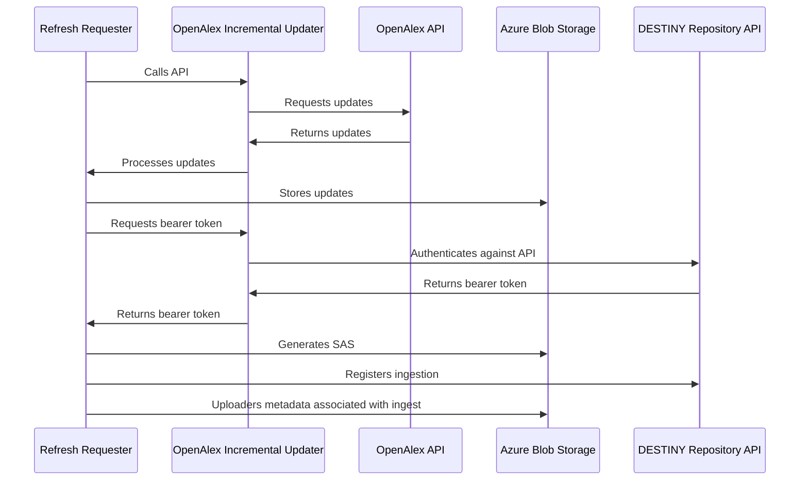

# OpenAlex Incremental Updater

A service to offer incremental updates from the OpenAlex API to the DESTINY repository.

## Overview

This repository contains two main components:

- **OpenAlex Incremental Updater**: A FastAPI service that fetches and processes updates from the OpenAlex API, storing them in a PostgreSQL database.
- **Refresh Requester**: A service that periodically requests updates from the OpenAlex Incremental Updater service, ensuring that the database is kept up-to-date with the latest changes.

OpenAlex Incremental Updater is intended to be run as an Azure Container App, scaled to zero replicas when not in use. It is designed to be triggered on a regular basis by the Refresh Requester service, which is run as an Azure Container App Job. The Refresh Requester service calls the OpenAlex Incremental Updater API to fetch updates, uploads them to internal Azure Blob Storage, generates share access signatures (SAS) for blobs and then trigger the DESTINY repository to process these updates.

Authentication against the DESTINY repository API is performed by an OpenAlex Incremental Updater endpoint using a registered Application in Azure. This endpoint is called by the Refresh Requester service to obtain an access token, which is then used to authenticate requests to the DESTINY repository API.

Diagrammatically, the architecture looks like this:



## Developers

Dependency management is handled by [uv](https://docs.astral.sh/uv/).

See the documentation within the [openalex_incremental_updater](openalex_incremental_updater) and [refresh_requester](refresh_requester) packages for details on how to install and run the service.

Ensure you install the pre-commit hooks by running:

```bash
uv run pre-commit install
```

after installing dependencies. This will ensure that code is automatically formatted and linted before committing changes.

### Running locally

To run the service locally, run the following commands from their respective directories:

```bash
    uvicorn openalex_incremental_updater.main:app --reload
```

```bash
    python refresh_requester/main.py
```

By default, `openalex-incremental-updater` will run on port 8000. Automatically generated API documentation will be available at `http://localhost:8000/docs`. You can change the port by modifying the command above with the `--port` flag.

### Containerisation

`Dockerfile`s are used to build container images for the service when deployed in Azure, and can also be used to run the service locally. Two convenience scripts are provided in the root of the repository to build and run both services in Docker containers.

To build the images, run:

```bash
./build_openalex_incremental_updater.sh
./build_refresh_requester.sh
```

Optional flags include:

- `--tag` to specify a custom tag for the image. The default tag is `latest`.
- `--no-cache` to build the image without using the cache, which can be useful if you want to ensure all dependencies are freshly installed.

Then run the built images with the convenience scripts:

```bash
./run_openalex_incremental_updater.sh
./run_refresh_requester.sh
```

Environment variables should be set in the respective `.env` files in the `openalex_incremental_updater` and `refresh_requester` directories. These files should not be committed to version control, as they may contain sensitive information such as API keys or database connection strings.

A `compose.yml` file is provided to run both services together in a Docker Compose environment. To start the services, run:

```bash
docker compose up --build
```

Which will successfully network the two services together, allowing the Refresh Requester to call the OpenAlex Incremental Updater API.

To bring the services down, run:

```bash
docker compose down
```

### Testing

To run the tests for the OpenAlex Incremental Updater and Refresh Requester services, use the following commands in their respective directories:

```bash
    uv run pytest
```

Pass the `--cov` flag to generate a coverage report, e.g.:

```bash
    uv run pytest --cov=openalex_incremental_updater
```

## Deployment

### Infra

Infrastructure is managed using [Terraform](https://www.terraform.io/). The [infra](https://github.com/destiny-evidence/openalex-incremental-updater/tree/main/infrastructure) directory contains the Terraform configuration files and documentation for deploying the OpenAlex Incremental Updater and Refresh Requester services to Azure and uses HCP Terraform to manage state. This is a crucial first step in deploying the services, and should be completed before attempting to deploy the services themselves.

### Deployment process

The OpenAlex Incremental Updater is deployed as an Azure Container App, which is scaled to zero replicas when not in use. The Refresh Requester is deployed as an Azure Container App Job, which runs on a schedule to trigger the OpenAlex Incremental Updater service. This is currently set to run once per day at 12:00 UTC, refreshing data for the current day.

Staging and production deployments are managed using GitHub Actions. On a sucessful pull request merge to `main`, staging deployments have Docker images automatically built and pushed to a defined Azure Container Registry. The Azure Container App is automatically updated with the pushed and tagged image. Production deployments are triggered manually via GitHub Actions workflow, which promotes the latest staging deployment to production. Environment variables for the Azure Container App are set using GitHub Secrets, ensuring that sensitive information is not exposed in the repository. Separate secrets are used for staging and production deployments, managed by GitHub Environments, allowing for different configurations in each environment.

Staging deployment images are tagged with the short SHA of the commit, and a unique tag is generated for production deployments by appending `-prod` to the short SHA. This allows for easy identification of the image version in use.

Check the environment secrets in the repository settings if you are having issues with deployments, as these are required for the services to function correctly. Cross-check with the github actions workflow files to ensure that the correct secrets are being used for each environment.

### Common issues

#### Deployment issues in CI

If GitHub actions fail to deploy things, check that you are using the correct credentials. `AZURE_CREDENTIALS` relies on a Service Principal existing with the relevant permissions. Ensure that this variable is set with the following format. Do **not** include a trailing comma on the last item.

```json
{
  "clientId": "<Client ID>",
  "clientSecret": "<Client Secret>",
  "subscriptionId": "<Subscription ID>",
  "tenantId": "<Tenant ID>"
}
```

You may need to generate a new client secret if you do not have access to the existing secret for the service principal, or if it has expired. If you update this secret, you may need to update the `REGISTRY_PASSWORD` variable too.

You may also see issues if the service principal does not have the `Container Apps Contributor` role associated with it for the specific Azure Container App you wish to update. This should be set up in the terraform config, but is worth double checking when debugging. The service principal also requires the `AcrPush` role on the Azure Container Registry in order to tag and push images.

#### Log Tables not showing in Container App Job Execution history

When infrastructure is set up, the Log Analytics Workspace may not contain the correct tables, causing logs to not be visible in the Azure portal. A similar issue is discussed in [this GitHub issue](https://github.com/microsoft/azure-container-apps/issues/450#issuecomment-3382908373). The solution observed to work is to set `disableLocalAuth` to `false` on the log analytics workspace.

Check the current value of this setting with:

```bash
az monitor log-analytics workspace show --resource-group <resource-group-name> --workspace-name <workspace-name>
```

if `true`, set it to `false` with:

```bash
az monitor log-analytics workspace update --resource-group <resource-group-name> --workspace-name <workspace-name> --set features.disableLocalAuth=false
```

Cancel any ongoing Container App Job runs, and then stop/start the Container App itself. On a retry, the log tables expected in the Container App Job Execution history logs should be visible.
